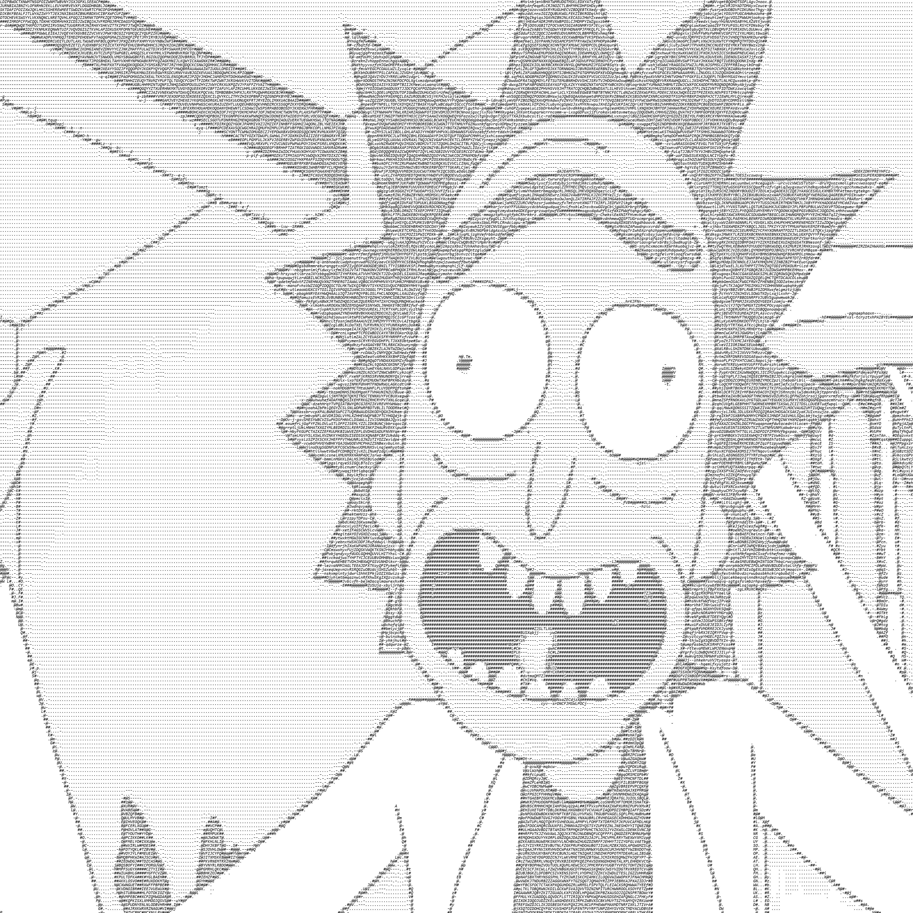

# ASCII-Converter
ASCII Converter for video and image
<br><br>
&nbsp;&nbsp;&nbsp;&nbsp;&nbsp;

## Requirement

Any version of Python 3 compatible with **Pillow**
```python
pip install pillow
```
For video editing, install **opencv-python** and **moviepy**

```python
pip install opencv-python
pip install moviepy
```
You can use **start_IMAGE.bat** or **start_VIDEO.bat**, and it will install all the requirements and launch the converter.

## How to Use

### Convert Image
Start **ASCII_Converter.py** if you already have the requirements, or use **start_IMAGE.bat** if you are not sure.
```
Drag and drop your picture here:
```
You can drag and drop your local picture in a **jpg** format (Don't use *png*, the program does not support transparency).
<br><br>
Then you will have to set a reducer:

> 1: no reduction (for really small images)
> 
> 3: Generally the best result
> 
> 4 or greater: big reduction (for large images)
```
Enter the amount of reduction; the greater the number, the smaller the image.
```
All done for the image! (*You can test different reductions for better results*)
<hr>

### Convert Video
Start **ASCII_Converter_Video_Edition.py** if you already have the requirements, or use **start_VIDEO.bat** if you are not sure.
```
Drag and drop your video here:
```
You can drag and drop your local picture in an **mp4** or **gif** format.
<br><br>
Then you will have to set a reducer:

> 1: no reduction (for really low definition)
> 
> 3: Generally the best result
> 
> 4 or greater: big reduction (for high definition)
```
Enter the amount of reduction; the greater the number, the smaller the image.
```
All done for the video! (*You can test different reductions for better results*)
<br><br>
*Please note that this process requires a lot of RAM if the video is long; try on a short video.*

## The Converter

The image is converted to greyscale; then, for each pixel, it's replaced by a character

```python
if pixel > 230:
    fichier.write("\u00a0")
elif pixel > 199:
    fichier.write(".")
elif pixel > 180:
    fichier.write("-")
elif pixel > 150:
    fichier.write(minu[randint(0, len(minu) - 1)])
elif pixel > 100:
    fichier.write(maj[randint(0, len(maj) - 1)])
elif pixel > 50:
    fichier.write("#")
else:
    fichier.write("@")
```
You can change the character in each `fichier.write("")` or the greyscale sensitivity in each test. <br>
Example : `if pixel > 230`,if you want the character to apply for a very bright white, you can put `if pixel > 250`.

## Text File

When you render a single image with the **ASCII_Converter.py**, you will also have a text file of the image (you need a font that changes all characters to the same size like **Consolas**).
<br>


```
..............................................................................
............................ . ...d#@@@@@@A...................................
...........................-@@@@@@@@@@@@@@@@@@@@@@............................
........................@@@@@@@@@@@@@@@@@@@@@@@@@@@@@@........................
.................... @@@@@@@@@@@@@@@@@@@@@@@@@@@@@@@@@@@@.....................
..................@@@@@@@@@@@@@@@@@@@@@@@@@@@@@@@@@@@@@@@@@...................
................@@@@@@@@@@@@@@@@@@@@@@@@@@@@@@@@@@@@@@@@@@@@@.................
..............u@@@@@@@@@@@@@@@@@@@@@@@@@@@@@@@@@@@@@@@@@@@@@@@@...............
.............@@@@@@@@@@@@@@@@@@@@@@@@@@@@@@@@@@@@@@@@@@@@@@@@@@@@.............
...........S@@@@@@@@@@@@@@@@@@@@@@@@@@@@@@@@@@@@@@@@@@@@@@@@@@@@@@............
..........@@@@@@@@@@@@@@@@@@@@@@@@@@@@@@@@@@@@@@@@@@@@@@@@@@@@@@@@@@ .........
.........@@@@@@@@@@@@@@@@@@@@@@@@@@@@@@@@@@@@@@@@@@@@@@@@@@@@@@@@@@@@.........
........@@@@@@@@@@@@@@@@@@@@@@@@@@@@@@@@@@@@@@@@@@@@@@@@@@@@@@@@@@@@@@........
.......@@@@@@@@@@@@.n@@@@@@@@@@@@@@@@@@@@@@@@@@@@@@@@@@@@@..@@@@@@@@@@@.......
......@@@@@@@@@@@@......#@@@@@@@@@@@@@@@@@@@@@@@@@@@@@......@@@@@@@@@@@@......
.....@@@@@@@@@@@@@.........@@@@@@@@@@@@@@@@@@@@@@@@@.........@@@@@@@@@@@@.....
.....@@@@@@@@@@@@@...........@w.................@K...........@@@@@@@@@@@@.....
....@@@@@@@@@@@@@#...........................................@@@@@@@@@@@@@....
...@@@@@@@@@@@@@@#...........................................@@@@@@@@@@@@@@...
...@@@@@@@@@@@@@@@...........................................@@@@@@@@@@@@@@...
..@@@@@@@@@@@@@@@@...........................................@@@@@@@@@@@@@@@..
..@@@@@@@@@@@@@@@@..........................................@@@@@@@@@@@@@@@@ .
..@@@@@@@@@@@@@@@............................................#@@@@@@@@@@@@@@@.
.@@@@@@@@@@@@@@@..............................................#@@@@@@@@@@@@@@.
.@@@@@@@@@@@@@@U...............................................@@@@@@@@@@@@@@.
.@@@@@@@@@@@@@@.................................................@@@@@@@@@@@@@j
.@@@@@@@@@@@@@@.................................................@@@@@@@@@@@@@@
-@@@@@@@@@@@@@@.................................................@@@@@@@@@@@@@@
#@@@@@@@@@@@@@@.................................................@@@@@@@@@@@@@@
@@@@@@@@@@@@@@@.................................................@@@@@@@@@@@@@@
@@@@@@@@@@@@@@@.................................................@@@@@@@@@@@@@@
#@@@@@@@@@@@@@@.................................................@@@@@@@@@@@@@@
-@@@@@@@@@@@@@@.................................................@@@@@@@@@@@@@@
.@@@@@@@@@@@@@@................................................#@@@@@@@@@@@@@@
.@@@@@@@@@@@@@@@...............................................@@@@@@@@@@@@@@k
.@@@@@@@@@@@@@@@..............................................#@@@@@@@@@@@@@@.
.@@@@@@@@@@@@@@@@.............................................@@@@@@@@@@@@@@@.
..@@@@@@@@@@@@@@@@...........................................@@@@@@@@@@@@@@@@ 
..@@@@@@@@@@@@@@@@@#..................................... .@@@@@@@@@@@@@@@@@..
..#@@@@@@@@@@@@@@@@@@@.. ..............................  @@@@@@@@@@@@@@@@@@@..
.. @@@@@@@#....@@@@@@@@@@-.... ......................@@@@@@@@@@@@@@@@@@@@@@n..
...#@@@@@@@@.....@@@@@@@@@@@@@@@...............@@@@@@@@@@@@@@@@@@@@@@@@@@@@...
....@@@@@@@@@#..#.@@@@@@@@@@@@@.................@@@@@@@@@@@@@@@@@@@@@@@@@@ ...
.....@@@@@@@@@@..@.@@@@@@@@@@@..................@@@@@@@@@@@@@@@@@@@@@@@@@@....
.....@@@@@@@@@@.....@@@@@@@@@@...................@@@@@@@@@@@@@@@@@@@@@@@@.....
......@@@@@@@@@@.. @..@@@@@@@ ...................@@@@@@@@@@@@@@@@@@@@@@@......
.......@@@@@@@@@@....#@.....@....................@@@@@@@@@@@@@@@@@@@@@@t......
........@@@@@@@@@N...............................@@@@@@@@@@@@@@@@@@@@@@.......
.........@@@@@@@@@@..............................@@@@@@@@@@@@@@@@@@@@@........
..........@@@@@@@@@@@@#.....N@...................@@@@@@@@@@@@@@@@@@@j.........
...........@@@@@@@@@@@@@@@@@@@.................. @@@@@@@@@@@@@@@@@@...........
............-@@@@@@@@@@@@@@@@@...................@@@@@@@@@@@@@@@@@............
..............@@@@@@@@@@@@@@@@...................@@@@@@@@@@@@@@@#.............
................@@@@@@@@@@@@@@...................@@@@@@@@@@@@@@...............
................ Q@@@@@@@@@@@@...................@@@@@@@@@@@@.................
....................@@@@@@@@@@...................@@@@@@@@@@...................
......................@@@@@@@@...................@@@@@@@V.....................
.........................@@@@....................@@@@W........................
..............................................................................
..............................................................................
```
## Known Issues

- The image is often stretched out due to size differences between pixels and characters.
- The video can be out of center and not fill the entire screen.
